# Use Case Diagrams & Visual Flows
## Healthcare-HR Bridge System

---

## DIAGRAM 1: System Use Case Overview

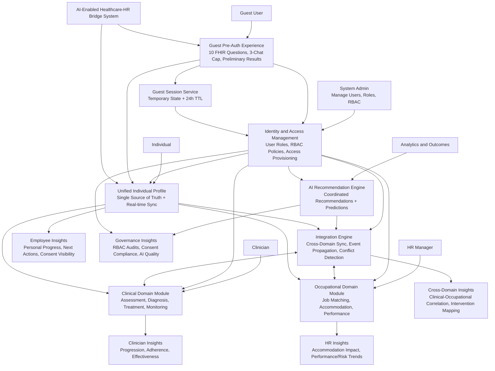

### Data Insights by Stakeholder (System Use Case Overview)

- Guest user insights: preliminary signal visualization, transparent reason-to-sign-in guidance, and limited pre-auth progress continuity.
- Clinician insights: symptom progression trends, adherence patterns, treatment effectiveness, and clinical-to-work impact signals.
- HR manager insights: accommodation effectiveness, performance trend shifts, absenteeism/retention risk indicators, and support program outcomes.
- Employee insights: personal recovery and work-function progress, recommended next actions, and transparent consent/sharing status.
- Cross-domain insights: correlation between clinical improvements and occupational outcomes, intervention effectiveness mapping, and adjustment timing signals.
- Governance and quality insights: role-based access audit trails, consent compliance monitoring, and AI calibration/fairness monitoring.

---

## DIAGRAM 2: Detailed Use Case Diagram (UML Style)

```mermaid
flowchart LR
    subgraph Actors
        CL[Clinician]
        IN[Individual]
        HR[HR Manager]
        MG[Manager/Supervisor]
        ES[External Systems]
        SA[System Admin]
    end

    subgraph System[Healthcare-HR Bridge System]
        U0((UC0: Guest onboarding and trust-building))
        U0A((UC0A: Complete 10-question FHIR preliminary questionnaire))
        U0B((UC0B: Use capped AI assistant (max 3 guest turns)))
        U0C((UC0C: Temporary guest session persistence with 24h TTL))
        U0D((UC0D: Authentication gate and redirect reasoning banner))
        U1((UC1: Initial diagnosis with coordinated planning))
        U2((UC2: Generate clinical assessment with occupational context))
        U3((UC3: Validate and share assessment results))
        U4((UC4: Generate coordinated recommendations))
        U5((UC5: Track interventions in both domains))
        U6((UC6: Monitor outcomes and cross-domain sync))
        U7((UC7: Trigger bidirectional feedback loops))
        U8((UC8: Comparative effectiveness insights))
        U9((UC9: Predict risks and recommend adjustments))
        U10((UC10: Support career planning and progression))
        U11((UC11: Integrate with EHR, HRIS, assessment tools))
    end

    IN --> U0
    IN --> U0A
    IN --> U0B
    IN --> U0C
    IN --> U0D
    CL --> U1
    CL --> U2
    IN --> U3
    IN --> U4
    HR --> U4
    HR --> U5
    HR --> U6
    MG --> U6
    MG --> U9
    MG --> U10
    ES --> U11
    SA --> U11
    SA --> U7

    U0 --> U0A
    U0 --> U0B
    U0A --> U0D
    U0B --> U0D
    U0C --> U0D
    U0D --> U1
```

---

## DIAGRAM 2A: Guest Pre-Auth to Authenticated Screening Flow

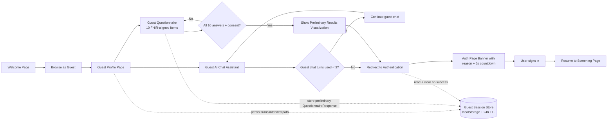

### Guest Flow Notes (Implemented)

- Guest users can complete a basic 10-question FHIR-structured preliminary questionnaire before authentication.
- Guest AI assistant is capped at 3 turns; on cap reach, user is redirected to authentication.
- Authentication includes contextual redirect reasoning with an auto-hide 5-second countdown banner.
- Temporary guest session state is persisted in localStorage and expires automatically after 24 hours (TTL).
- Post-login flow resumes to the screening route to continue full assessment workflow.

---

## DIAGRAM 3: Sequence Diagram - Initial Diagnosis with Coordinated Planning

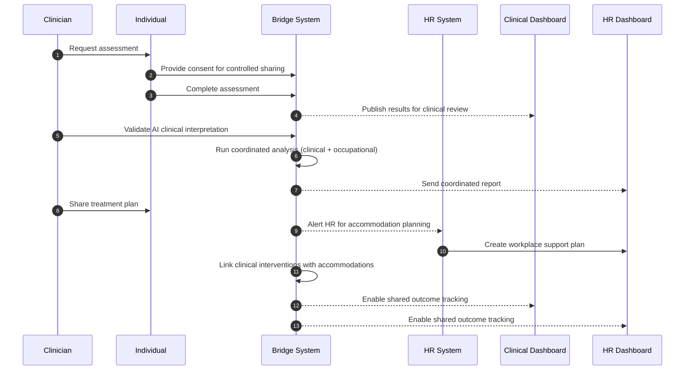

---

## DIAGRAM 4: Sequence Diagram - Existing Employee Underperformance

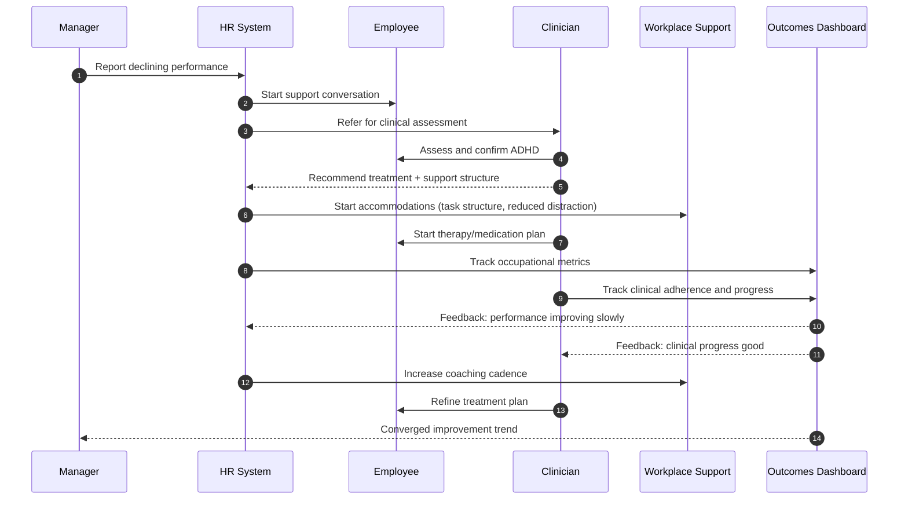

---

## DIAGRAM 5: Data Flow - The Bridge in Action

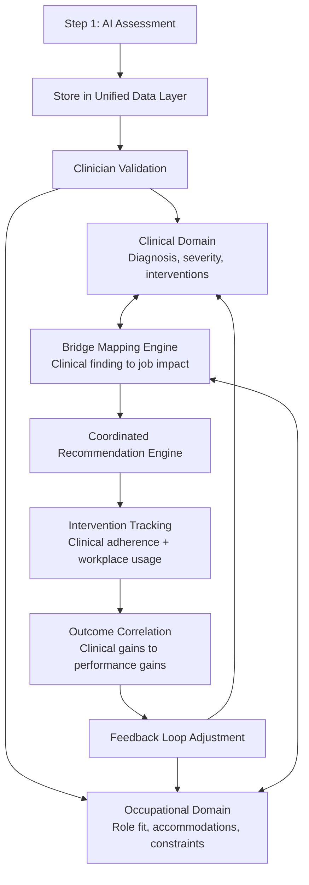

---

## DIAGRAM 6: System Interaction Map

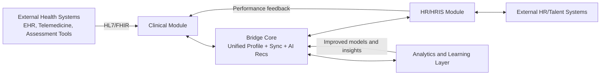

---

## DIAGRAM 7: Consent and Privacy Flow

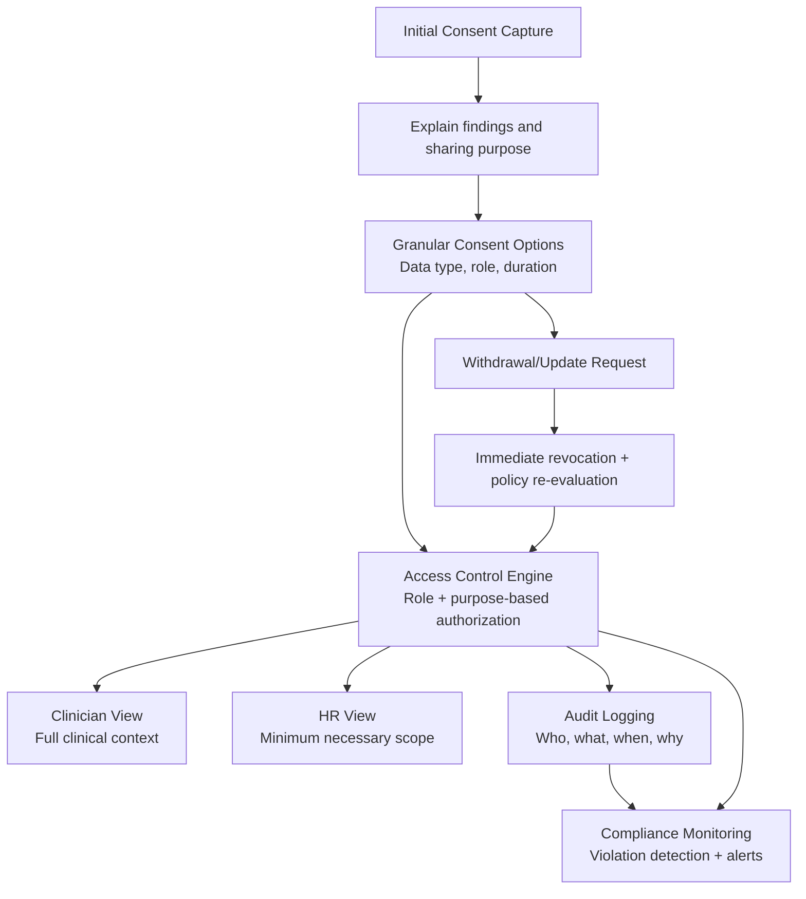

---

## DIAGRAM 8: Key Differentiators - Bridge vs Traditional Approach

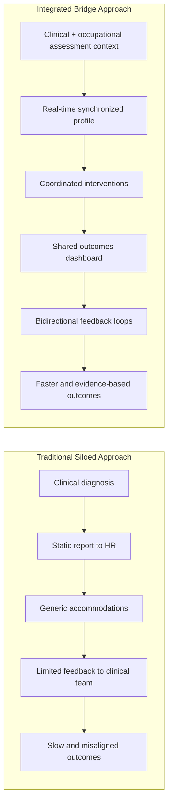

### Key Differences Table

| Dimension | Traditional | Bridge System |
|---|---|---|
| Diagnosis Speed | 3-8 weeks | 1-2 weeks (AI-assisted) |
| HR Involvement | After diagnosis | At assessment stage |
| Data Sharing | One-time static report | Real-time synchronized |
| Accommodation Plan | Generic checklist | Clinically-informed, context-aware |
| Action Timing | Serial | Parallel |
| Feedback | Minimal | Continuous bidirectional loop |
| Success Measurement | Single-domain | Linked clinical + occupational |

---

## SUMMARY: The Bridge in Action Visually

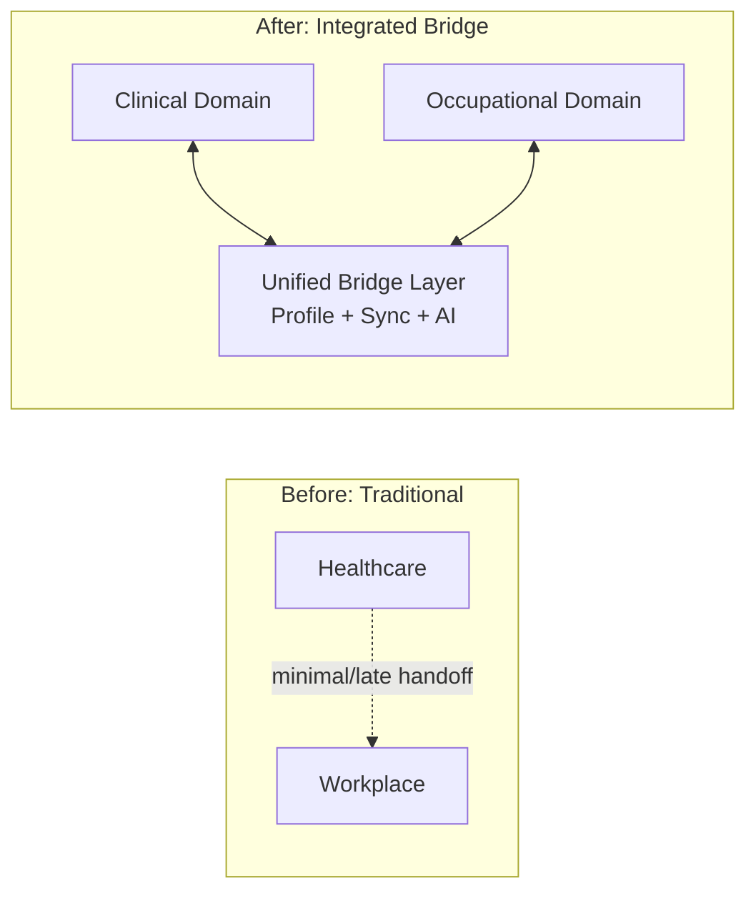

---

## DIAGRAM 9: Companion View - Business Model Canvas (Healthcare-HR Bridge)

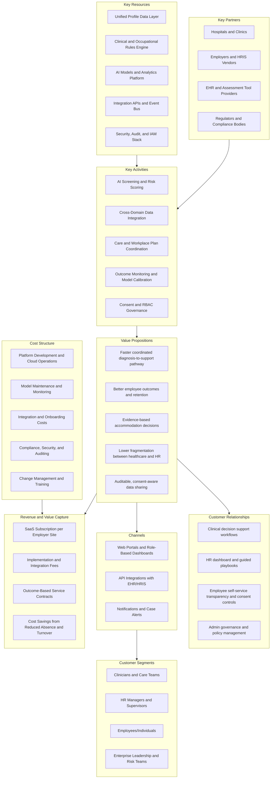

---

## DIAGRAM 10: Companion View - Causal Loop Diagram (System Thinking)

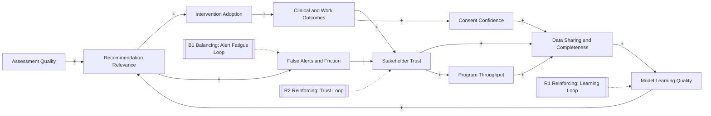

---

## DIAGRAM 11: Companion View - Governance and Value Realization Map

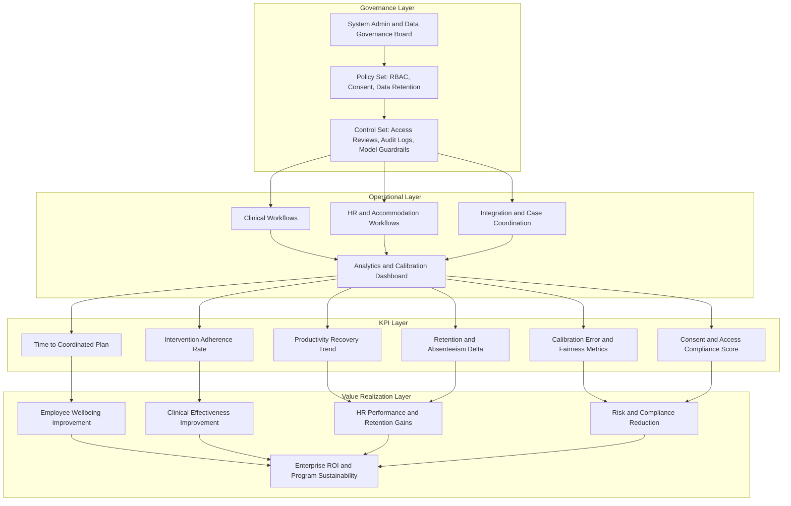

