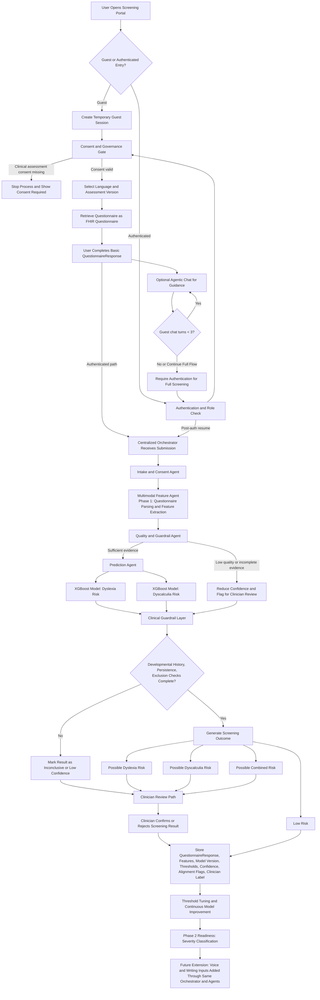

# CareLink Questionnaire-First Dyslexia and Dyscalculia Screening Workflow

## Overview

This document describes the finalized end-to-end workflow for the CareLink questionnaire-first screening process for dyslexia and dyscalculia. It consolidates the screening entry flow, the agent-based architecture, the machine learning decision path, the clinical guardrails, and the future extensibility path for severity classification and multimodal inputs.

The current implementation direction is intentionally phased:

1. Start with questionnaire-based symptom screening.
2. Predict dyslexia risk and dyscalculia risk.
3. Keep clinician-in-the-loop for confirmation.
4. Add severity classification after screening performance becomes stable.
5. Add voice and writing as later multimodal enhancements.

## Finalized Design Decisions

The following decisions were finalized for the CareLink screening workflow:

1. The first production scope is questionnaire-based screening, not full multimodal assessment.
2. The questionnaire content should be custom curated and clinically reviewed.
3. Questionnaire exchange should use FHIR resources, specifically `Questionnaire` and `QuestionnaireResponse`.
4. XGBoost is the primary screening model for initial dyslexia and dyscalculia detection.
5. A centralized orchestrator remains the main control pattern.
6. A reduced 5-agent architecture is preferred over a larger 9 to 11 agent design at the current stage.
7. DSM-5-TR and ICD-11 are used as alignment frameworks, but the system should not claim autonomous diagnosis.
8. Higher-risk or low-confidence cases must be escalated to clinician review.
9. Guest users can access a basic questionnaire and up to 3 agentic chat iterations before authentication is required.

## System Flowchart

## End-to-End Process

### 1. Screening Entry Point

The process begins when a user, employee, clinician, or authorized intake staff opens the screening portal in the CareLink web application.

At this stage, the system:

1. determines whether the user is entering as a guest or authenticated user,
2. creates a temporary guest session for anonymous use,
3. enforces authentication and role checks for full workflow access,
4. initializes language and assessment selection.

This is the formal entry point into the questionnaire-first screening pipeline.

### 2. Consent and Governance Gate

Before presenting any screening questions, the platform validates the consent and governance requirements.

This includes:

1. consent for clinical assessment,
2. optional consent for HR accommodation sharing,
3. optional consent for research use,
4. consent expiry where applicable.

If clinical assessment consent is missing, the process stops and the user is informed that consent is required before screening can proceed.

For guest users, this gate still applies. Guests may proceed with a basic questionnaire and limited guidance chat, but full workflow continuation requires authentication.

### 2.1 Guest Pre-Auth Experience Boundary

Before authentication, guest users are allowed to:

1. complete a basic questionnaire,
2. interact with the agentic chat for up to 3 iterations,
3. receive non-diagnostic, preliminary guidance.

Before authentication, guest users are not allowed to:

1. access full screening outcomes,
2. persist longitudinal history,
3. trigger clinician/HR governance workflows.

### 3. Questionnaire Retrieval Layer

After consent is confirmed, the frontend requests the active questionnaire definition from the questionnaire service.

The recommended model is:

1. questionnaire content is your own curated and clinically reviewed item set,
2. questionnaire transport and versioning use FHIR resources,
3. responses are submitted as `QuestionnaireResponse`.

This provides both local flexibility and future interoperability with healthcare systems.

### 4. Questionnaire Composition

The questionnaire is not created arbitrarily. It is built from a clinical construct map that aligns symptoms and impact indicators to dyslexia and dyscalculia screening needs.

For dyslexia, the questionnaire should include constructs such as:

1. slow or effortful reading,
2. word-reading errors,
3. decoding difficulty,
4. spelling and orthographic difficulty,
5. reading comprehension strain,
6. functional impact.

For dyscalculia, the questionnaire should include constructs such as:

1. number sense difficulty,
2. arithmetic fact retrieval difficulty,
3. procedural calculation difficulty,
4. quantitative reasoning difficulty,
5. functional impact.

Additional supporting items should also cover:

1. persistence or developmental history,
2. contextual factors,
3. exclusion-related screening flags,
4. quality-control items.

### 5. Questionnaire Completion

The user completes the questionnaire using a structured response format, such as a Likert scale from 0 to 4.

During submission, the system should:

1. validate required responses,
2. identify missing answers,
3. detect obvious inconsistencies,
4. capture submission metadata,
5. store the assessment version and language.

At the end of this stage, the platform has a completed `QuestionnaireResponse` and the associated metadata needed for downstream processing.

### 6. Centralized Orchestrator Receives the Submission

The centralized orchestrator is the main workflow controller for this phase.

Its responsibilities are to:

1. receive the questionnaire response,
2. route it to the correct agents,
3. enforce execution order,
4. manage retries and fallback logic,
5. maintain an audit trail,
6. apply workflow-level policies.

At the current scale, this pattern is sufficient and appropriate.

### 7. Reduced 5-Agent Architecture

To keep the solution goal-oriented and manageable, the screening workflow uses five focused agents.

#### 7.1 Intake and Consent Agent

Mission:
Validate identity, consent, language, assessment version, and request completeness.

#### 7.2 Multimodal Feature Agent

Mission:
For Phase 1, convert questionnaire responses into model-ready features. In future phases, this same agent can also process voice and writing inputs.

#### 7.3 Quality and Guardrail Agent

Mission:
Check response quality, detect incomplete evidence, apply persistence and exclusion logic, and determine whether confidence should be downgraded.

#### 7.4 Prediction Agent

Mission:
Run the dyslexia and dyscalculia screening models.

#### 7.5 Recommendation Agent

Mission:
Generate the screening outcome, triage decision, referral recommendation, and future role-based work plan outputs.

### 8. Feature Engineering from Questionnaire Responses

The raw questionnaire answers are transformed into structured numeric features for model input.

Typical feature groups include:

1. dyslexia symptom score,
2. dyslexia reading fluency symptom score,
3. dyslexia reading error symptom score,
4. dyslexia spelling symptom score,
5. dyslexia functional impact score,
6. dyscalculia number sense score,
7. dyscalculia arithmetic retrieval score,
8. dyscalculia procedural calculation score,
9. dyscalculia functional impact score,
10. persistence or history score,
11. exclusion flag indicators,
12. response consistency score.

These features form the input vector for the XGBoost models.

### 9. Model Layer: Phase 1 Screening

The first phase focuses on binary screening rather than full severity classification.

The recommended model configuration is:

1. one XGBoost binary model for dyslexia risk,
2. one XGBoost binary model for dyscalculia risk.

The model outputs should include:

1. dyslexia probability,
2. dyslexia screening decision,
3. dyscalculia probability,
4. dyscalculia screening decision,
5. model confidence.

XGBoost is recommended because it performs strongly on structured tabular data, supports nonlinear patterns, and works well with moderate dataset sizes.

### 10. Clinical Guardrail Layer

Model output should never be treated as an autonomous diagnosis.

The clinical guardrail layer checks whether:

1. developmental history is captured,
2. persistence signals are present,
3. exclusion flags are incomplete,
4. confidence is too low,
5. questionnaire evidence is contradictory,
6. enough evidence exists for reliable screening.

If evidence is incomplete, the system should:

1. reduce confidence,
2. mark the result as inconclusive or cautionary,
3. route the case to clinician review.

This is the operational point where DSM-5-TR and ICD-11 alignment becomes meaningful.

### 11. Screening Decision Logic

After model prediction and clinical guardrails are applied, the system generates a safe screening outcome.

Recommended outcomes are:

1. low-risk screen,
2. possible dyslexia risk,
3. possible dyscalculia risk,
4. possible combined risk,
5. inconclusive due to insufficient evidence.

The system should use the language of screening or risk indication, not definitive diagnosis.

### 12. Clinician Review Path

Clinician review is required when:

1. confidence is low,
2. risk exceeds threshold,
3. exclusion checks are incomplete,
4. persistence history is unclear,
5. combined dyslexia and dyscalculia risk is detected.

The clinician can then:

1. confirm the screening result,
2. reject the screening result,
3. add a structured label,
4. later assign severity once that phase is implemented.

### 13. Storage and Audit

The system must persist both the original questionnaire response and the derived screening result.

The stored record should include:

1. original `QuestionnaireResponse`,
2. derived feature vector,
3. model version,
4. threshold version,
5. confidence score,
6. standards-alignment flags,
7. clinician label if available,
8. audit trail metadata.

This supports traceability, tuning, retraining, and governance.

### 14. Threshold Tuning and Continuous Improvement

As clinician-reviewed labels accumulate, the screening thresholds can be refined.

This process should:

1. compare predictions with clinician-confirmed labels,
2. tune thresholds separately for dyslexia and dyscalculia,
3. prioritize high recall for meaningful positive cases,
4. preserve acceptable specificity,
5. monitor AUC, recall, precision, and false negatives.

This allows the model to improve over time with real-world evidence.

### 15. Phase 2: Severity Prediction

Severity prediction should only be introduced after Phase 1 screening is stable and there is enough high-quality labeled severity data.

The severity classes would be:

1. mild,
2. moderate,
3. severe.

The recommended model path for this phase is ordinal XGBoost or another ordinal boosting strategy, again with clinician confirmation.

### 16. Future Multimodal Expansion

The architecture is intentionally designed so that future voice and writing modalities can be added without redesigning the whole workflow.

In future phases:

1. the Multimodal Feature Agent expands to process voice and writing,
2. the same orchestrator remains in control,
3. the same Prediction Agent can consume richer fused features,
4. confidence improves when modalities agree.

This preserves architectural continuity while expanding the signal quality of the screening pipeline.

## Final Operating Model

The finalized operating model is:

1. the user enters the screening portal as guest or authenticated,
2. consent is validated,
3. guest users can complete a basic questionnaire and up to 3 chat iterations,
4. authentication is required to continue into full workflow,
5. the questionnaire is retrieved in FHIR format,
6. the user completes symptom and functional-impact items,
7. the centralized orchestrator receives the response,
8. the reduced 5-agent architecture processes the case,
9. questionnaire answers are converted into model-ready features,
10. XGBoost predicts dyslexia risk and dyscalculia risk,
11. clinical guardrails check completeness and safety,
12. the system returns a screening result with confidence,
13. higher-risk or low-confidence cases are escalated to clinician review,
14. outcomes are stored for threshold tuning and future severity modeling.

## Conclusion

The recommended MVP path for CareLink is:

1. questionnaire-first,
2. FHIR-structured,
3. XGBoost-based screening,
4. centralized orchestration,
5. reduced 5-agent architecture,
6. clinician-in-the-loop,
7. severity classification only after stable screening performance.

This approach keeps the system clinically safer, technically feasible, and extensible for later multimodal screening and severity estimation.