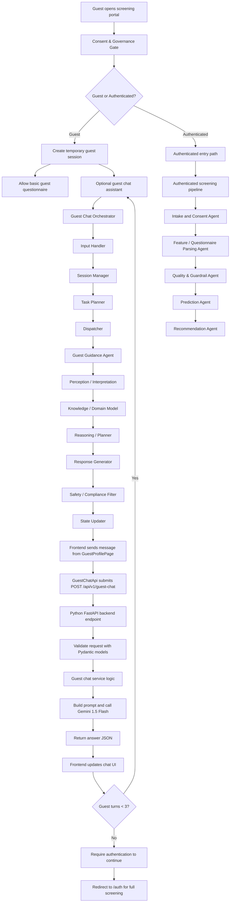

# Guest User Chat Flow

This document describes the full guest chat flow for CareLink, including the optional agentic chat assistant, the guest questionnaire boundary, and the files involved in the frontend and Python backend.

## Flow summary

Guest users can:
- complete a basic questionnaire
- optionally use the guest chat assistant for up to 3 turns before authentication is required

The guest chat flow is a pre-auth guidance layer separate from the authenticated screening pipeline.

## Mermaid flowchart

## Relevant files in the flow

### Frontend

- `apps/web-frontend/src/pages/GuestProfilePage.tsx`
  - main chat UI and turn-counter logic
  - sends guest messages and renders assistant replies
- `apps/web-frontend/src/services/guestChatApi.ts`
  - makes `POST /api/v1/guest-chat` calls to the backend

### Python backend

- `apps/python-backend/src/app/api/guest_chat.py`
  - FastAPI route for `/api/v1/guest-chat`
- `apps/python-backend/src/app/models/guest_chat.py`
  - request/response Pydantic models
- `apps/python-backend/src/app/services/guest_chat_service.py`
  - service-layer business logic for guest chat
  - builds the semantic prompt and would call Gemini 1.5 Flash
- `apps/python-backend/src/app/main.py`
  - FastAPI application entrypoint
- `apps/python-backend/pyproject.toml`
  - Python package and dependency configuration

## How the guest chat fits in

- The guest chat assistant is an optional, pre-auth guidance service.
- It is orchestrated by a dedicated `Guest Chat Orchestrator` that manages:
  - guest session validation
  - turn counting and guest chat limits
  - conversation history routing
  - consent and governance gating
  - handoff to authentication or the authenticated screening orchestrator
- It lives alongside the guest questionnaire, not in the authenticated model pipeline.
- It is intended to provide:
  - questionnaire guidance
  - privacy/process explanations
  - non-diagnostic preliminary assistance
  - sign-in encouragement after the guest chat cap

## Guest Chat Orchestrator Components

A proper orchestration agent contains discrete components that manage the guest chat flow, including:

- **Input Handler**
  - receives the raw chat request from the frontend
  - validates payload shape and session data
  - normalizes the guest message and attaches metadata

- **Session Manager**
  - tracks temporary guest session state and TTL
  - enforces the guest chat turn limit
  - decides whether to continue chat or require authentication

- **Task Planner**
  - interprets request intent and classifies the task
  - chooses whether the guest needs:
    - general guidance
    - questionnaire help
    - privacy/process explanation
    - a sign-in prompt

- **Dispatcher**
  - routes the task to the appropriate handler or agent
  - sends chat requests to the `Guest Guidance Agent`
  - handles retries and fallback behavior

- **Context Manager**
  - maintains recent conversation history
  - truncates and preserves the right context for the model prompt

- **Policy / Guardrail Layer**
  - enforces business rules such as:
    - no clinical diagnosis in guest mode
    - only preliminary guidance
    - guest chat limit enforcement
    - consent requirements

- **Response Assembler**
  - builds the final response payload for the frontend
  - includes next-step instructions and chat state

## Guest Guidance Agent Components

The chat assistant itself should also be modular, with subcomponents such as:

- **Perception / Interpretation**
  - parses the user’s message
  - extracts intent and entities
  - identifies whether the question is about questionnaire guidance, privacy, or next steps

- **Knowledge / Domain Model**
  - contains domain-specific guidance content
  - includes screening terminology, questionnaire rules, and privacy/process explanations

- **Reasoning / Planner**
  - determines how to answer based on intent and context
  - decides whether to respond directly, ask for clarification, or prompt authentication

- **Response Generator**
  - produces fluent user-facing text
  - applies domain constraints, for example:
    - “do not diagnose”
    - “provide only preliminary screening guidance”
    - “encourage signing in for full support”

- **Safety / Compliance Filter**
  - reviews generated text before returning it
  - ensures the answer remains within guest-only scope and policy limits

- **State Updater**
  - updates temporary guest chat state if needed
  - records conversation history and turn counts for the orchestrator

## Meaningful answer generation

To return a meaningful answer, the backend service:
1. validates the guest chat request
2. formats a semantically rich prompt with history and constraints
3. sends that prompt to Gemini 1.5 Flash
4. receives the semantic answer
5. returns the answer to the frontend

This keeps the guest chat experience aligned with the workflow rules and the 3-turn pre-auth limit.
